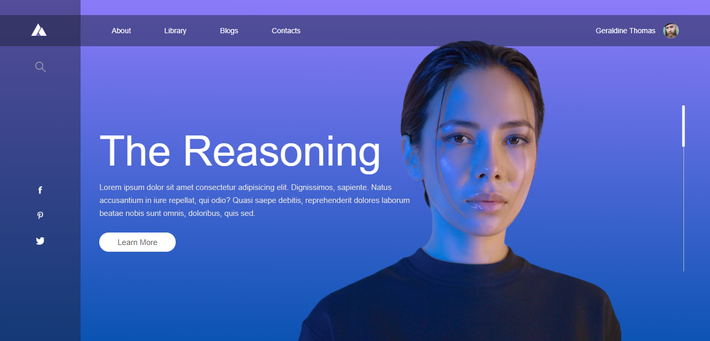

<!-- PROJECT LOGO -->
 

  

  <h3 align="center">Manuel Edwardo Paez</h3>
  

    
     
     
    <a href="https://github.com/manueledwardopaez/Website-With-Sliding/issues">View Demo</a>
    ·
    <a href="https://github.com/manueledwardopaez/Website-With-Sliding/issues">Report Bug</a>
    ·
    <a href="https://github.com/manueledwardopaez/Website-With-Sliding/issues">Request Feature</a>
  

<!-- TABLE OF CONTENTS -->
## Table of Contents

* [About the Project](#about-the-project)
  * [Built With](#built-with)

<!-- ABOUT THE PROJECT -->
## About The Project

This is a project made by watching the [EasyTutorials](https://www.youtube.com/channel/UCkjoHfkLEy7ZT4bA2myJ8xA) videos, to practice my Web Design skills.

### Built With
* HTML
* CSS
* JavaScript

